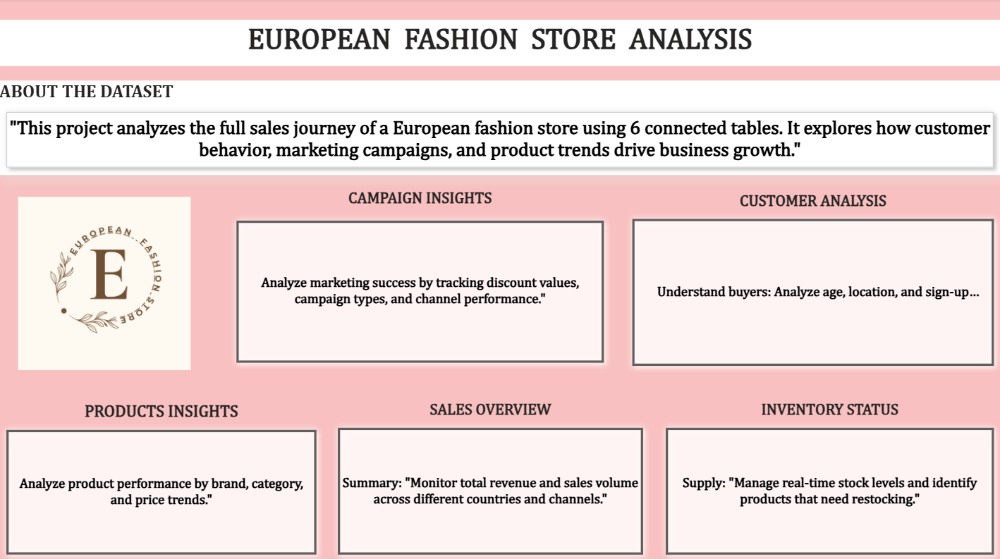
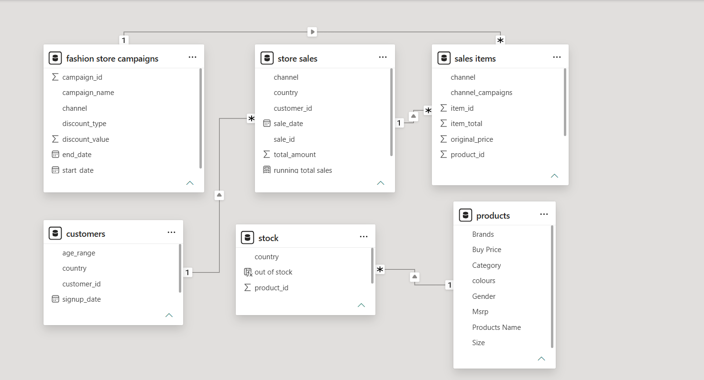
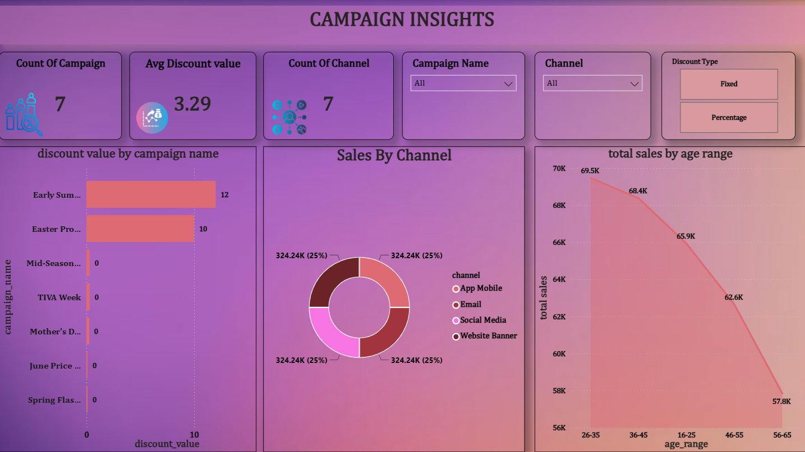
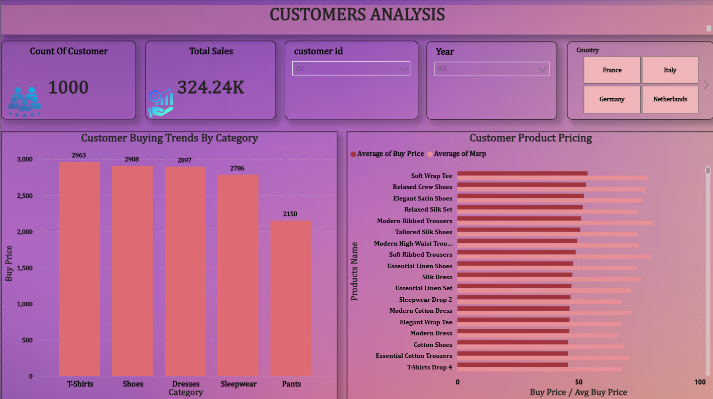
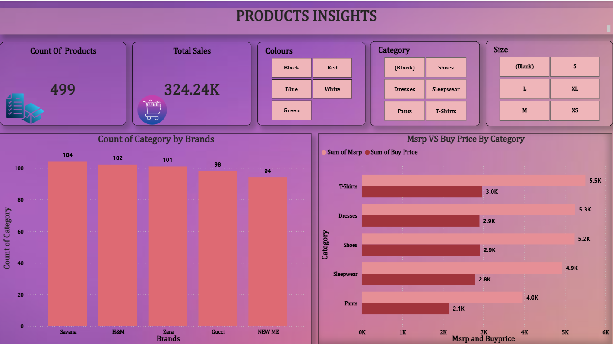
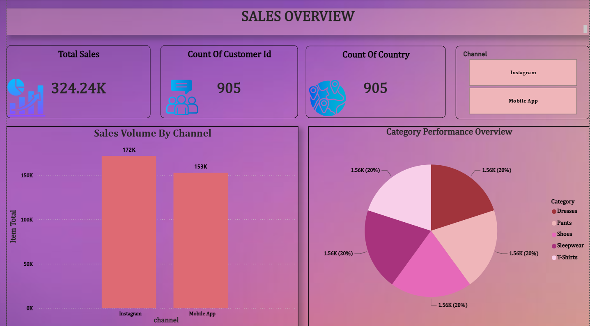
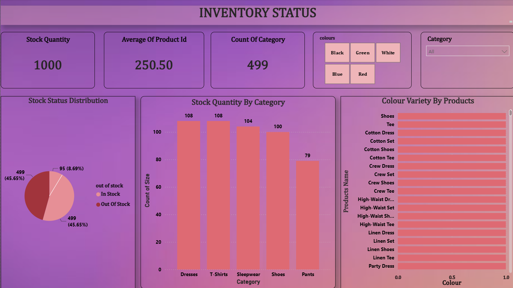

# 🛍️ European Fashion Store — Sales & Business Analytics

A **Power BI Business Intelligence project** analyzing sales, customers, products, campaigns, inventory, countries, and sales channels for a European fashion store.

The project transforms six connected retail tables into an interactive analytics solution designed to support **business performance monitoring and data-driven decision-making**.

---

## 📊 Project Overview

The **European Fashion Store Sales & Business Analytics Dashboard** provides a centralized view of fashion-retail performance across multiple business areas.

The project analyzes:

* 💰 Sales Performance
* 👥 Customer Behavior
* 👗 Product Performance
* 📢 Campaign Effectiveness
* 📦 Inventory & Stock Availability
* 🌍 Country Performance
* 📱 Sales Channel Performance

### Analytics Flow

**Raw Data → Data Cleaning → Data Modeling → DAX → Power BI Dashboards → Business Insights**

---

## 🎯 Project Objectives

* Analyze overall sales and revenue performance.
* Understand customer behavior across different markets.
* Identify high-performing products, brands, and categories.
* Evaluate campaign and discount performance.
* Monitor inventory and stock-out situations.
* Compare performance across countries and sales channels.
* Build an interactive Power BI Business Intelligence solution.
* Generate actionable business recommendations.

---

## 🚨 Business Problem

The business data is distributed across **six connected tables**, making it difficult for stakeholders to obtain a centralized view of overall performance.

The project addresses the following challenges:

* Limited visibility into overall sales performance
* Difficulty identifying high-performing products
* Challenges in understanding customer behavior
* Difficulty evaluating campaign and discount strategies
* Limited visibility into inventory and stock-outs
* Difficulty comparing countries and sales channels

---

## 🗂️ Dataset Overview

The project uses **six relational tables** covering different aspects of the fashion-store business.

| Table                      | Description                                                            |
| -------------------------- | ---------------------------------------------------------------------- |
| **Customer**               | Customer demographics and acquisition information                      |
| **Fashion Store Campaign** | Campaign and discount information                                      |
| **Product**                | Brand, category, pricing, colour, gender, product and size information |
| **Sales Item**             | Item-level sales transactions                                          |
| **Stock**                  | Inventory and stock availability                                       |
| **Stores Sales**           | Sales, customers, channels, countries and revenue                      |

---

## 🧹 Data Preparation & Transformation

The data was prepared before building the Power BI dashboards.

### Key Preparation Steps

* Data cleaning
* Duplicate handling
* Null / missing-value treatment
* Data-type validation
* Standardization of categorical fields
* Date preparation and formatting
* Relationship creation across tables
* Calculated columns
* DAX measures for KPI analysis

### Transformation Pipeline

**Raw Data → Power Query → Data Model → DAX → Visualization**

---

## 🔗 Data Modeling

The project uses a **star-schema-style relational model** across the six tables.

### Dimension Context

* Customer
* Product
* Campaign

### Transactional / Fact Data

* Stores Sales
* Sales Item
* Stock

The model uses **one-to-many relationships** to support appropriate filter propagation and reliable DAX calculations.

---

# 📈 Power BI Dashboard

The Power BI report contains **7 report pages**, including the navigation page, data model, and five analytical/business dashboards.

---

## 1️⃣ Report Home & Navigation

The landing page provides an overview of the complete analytics suite.

### Key Features

* Central navigation across the report
* Access to Campaign, Customer, Product, Sales and Inventory pages
* Business-purpose descriptions for each report section
* Quick orientation across the complete Power BI report

### Business Question

> **How can stakeholders navigate the full analytics suite quickly?**

### Dashboard Preview



---

## 2️⃣ Data Modeling

This page presents the underlying Power BI data model.

### Key Features

* Star-schema-style relationships
* Customer, Product and Campaign dimensions
* Store Sales, Sales Items and Stock transactional data
* One-to-many relationships
* Filter propagation across related tables
* Structured model supporting DAX analysis

### Business Question

> **How is the underlying data structured to support reliable analysis?**

### Dashboard Preview



---

## 3️⃣ Campaign Analytics

The Campaign Analytics dashboard evaluates promotional activity and discount performance.

### Key Analysis

* 7 campaigns tracked
* Average discount value of **3.29**
* Discount value by campaign
* Campaign channel performance
* Sales by customer age range

### Key Findings

* **Early Summer** and **Easter Promotions** show the highest discount activity.
* Sales are distributed across **App Mobile, Email, Social Media and Website Banner**.
* Total sales by age range decline from approximately **69.5K for ages 26–35** to **57.8K for ages 56–65**.

### Business Question

> **Which campaigns and promotional strategies perform effectively?**

### Dashboard Preview



---

## 4️⃣ Customer Analytics

The Customer Analytics dashboard focuses on customer distribution and purchasing behavior.

### Key Analysis

* Customer count
* Total sales
* Country filtering
* Year filtering
* Category-level buying trends
* Average Buy Price vs MSRP

### Key Findings

* The analysis covers **1,000 customers** across France, Italy, Germany and the Netherlands.
* **T-Shirts, Shoes and Dresses** are among the leading buying categories.
* Average Buy Price and MSRP are compared across top products.

### Business Question

> **Who are our customers, and how do they contribute to the business?**

### Dashboard Preview



---

## 5️⃣ Product Performance

The Product Performance dashboard analyzes product and brand-level performance.

### Key Analysis

* Product count
* Total sales
* Brand performance
* Category analysis
* MSRP vs Buy Price
* Colour
* Size

### Key Findings

* **499 products** are tracked.
* Five brands are represented:

  * Savana
  * H&M
  * Zara
  * Gucci
  * NEW ME
* MSRP vs Buy Price is compared by category to assess margin patterns.

### Business Question

> **Which products, brands and categories are driving performance?**

### Dashboard Preview



---

## 6️⃣ Executive Sales Overview

The Executive Sales Overview provides a high-level view of overall business performance.

### Key Analysis

* Total Sales
* Customer Count
* Country Count
* Sales channel performance
* Category revenue contribution
* Interactive channel filtering

### Key Finding

**Instagram** contributes approximately **172K** in sales compared with **153K** from the **Mobile App**.

The five product categories contribute relatively evenly to overall revenue, at approximately **20% each**.

### Business Question

> **How is the fashion store performing overall?**

### Dashboard Preview



---

## 7️⃣ Inventory & Stock Analytics

The Inventory & Stock dashboard monitors product availability and inventory distribution.

### Key Analysis

* Total stock units
* Stock status
* Category-level stock
* Product colour variety
* Inventory availability

### Key Findings

* **1,000 total stock units** are tracked.
* **499 products/categories** are represented in the analysis.
* Stock status shows **45.65% in stock vs 45.65% out of stock**.
* **Dresses and T-Shirts** hold the highest stock quantities.

### Business Question

> **Where are the inventory gaps that could affect sales?**

### Dashboard Preview



---

# 🔍 Key Business Insights

### 💰 Sales

Instagram outpaces the Mobile App with approximately **172K vs 153K** in sales contribution.

The five product categories have a relatively balanced revenue contribution of around **20% each**.

### 👥 Customer

The dataset includes **1,000 customers** across France, Italy, Germany and the Netherlands.

T-Shirts, Shoes and Dresses are among the strongest buying categories.

### 👗 Product

The analysis covers **499 products across five brands** — Savana, H&M, Zara, Gucci and NEW ME.

MSRP-to-Buy-Price comparisons provide visibility into category-level margin patterns.

### 📢 Campaign

Seven campaigns are tracked, with **Early Summer** and **Easter Promotions** showing the highest discount activity.

Sales are distributed across four campaign channels.

### 📦 Inventory

Inventory analysis tracks **1,000 stock units**, with stock status showing a near-even split between in-stock and out-of-stock inventory.

Dresses and T-Shirts hold the highest stock quantities.

### 🌍 Geography & Channels

Sales are tracked across multiple European countries and digital channels, enabling direct market and channel comparisons.

---

# 💡 Business Recommendations

### 1. Reduce Stock-Out Risk

Prioritize inventory monitoring for high-demand categories such as **Dresses and T-Shirts**.

### 2. Reinvest in Stronger Channels

Consider increasing focus on **Instagram**, which shows stronger sales contribution than the Mobile App.

### 3. Optimize Promotional Campaigns

Evaluate and scale successful campaign patterns such as **Early Summer and Easter Promotions**.

### 4. Protect Product Margins

Monitor the **MSRP-to-Buy-Price gap** across categories to maintain healthy margins.

### 5. Use Customer Segmentation

Use age-range and country-level segmentation to create more targeted promotional campaigns.

### 6. Monitor Brand Performance

Track brand-level performance to identify strong-performing brands and improve product portfolio decisions.

### 7. Balance Channel Strategy

Continue monitoring Email, Social Media, Website Banner and Mobile/App channels to maintain an effective channel mix.

### 8. Enable Continuous Monitoring

Use the Power BI dashboard as an ongoing performance-monitoring tool for business stakeholders.

---

# 🛠️ Tools & Technologies

| Tool / Technology | Usage                                     |
| ----------------- | ----------------------------------------- |
| **Power BI**      | Dashboard development and visualization   |
| **Power Query**   | Data cleaning and transformation          |
| **DAX**           | KPI calculations and analytical measures  |
| **Excel / CSV**   | Data source and preparation               |
| **GitHub**        | Project documentation and version control |

---

# 🧠 Skills Demonstrated

* Data Cleaning
* Data Transformation
* Data Modeling
* Star Schema
* DAX Measures
* KPI Development
* Data Visualization
* Dashboard Development
* Business Intelligence
* Sales Analytics
* Customer Analytics
* Product Analytics
* Campaign Analysis
* Inventory Analytics
* Business Insights
* Data-Driven Decision Making

---

# 📁 Repository Structure

```text
european-fashion-store-analytics/
│
├── README.md
│
├── Dashboard images/
│   ├── 1st image Report Home & Navigation.png
│   ├── 2nd Data Modeling.png
│   ├── 3rd Campaign Analytics.png
│   ├── 4th Customer Analytics.png
│   ├── 5th Product Performance.png
│   ├── 6th Executive Sales Overview.png
│   └── 7th Inventory & Stock Analytics.png
│
├── powerbi/
│   └── European_Fashion_Store_Dashboard.pbix
│
└── documentation/
    └── European_Fashion_Store_BI_Presentation.pdf
```

---

# 🎯 Project Outcome

This project transformed **six connected fashion-retail tables** into a centralized and interactive Power BI Business Intelligence solution.

The final report enables stakeholders to:

* Monitor sales performance
* Understand customer behavior
* Evaluate product performance
* Measure campaign effectiveness
* Monitor inventory
* Compare countries
* Compare sales channels
* Identify business opportunities
* Support data-driven decisions

---

## 🚀 Final Takeaway

> **Turning Retail Data into Actionable Business Insights.**

---

## 👨‍💻 Author

**Roz Rajak**

**Data Analytics | Power BI | Excel | 

